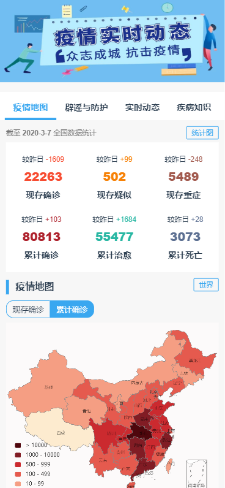
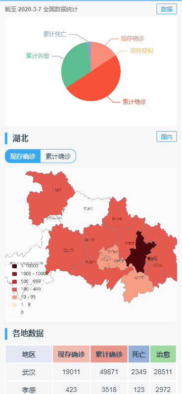
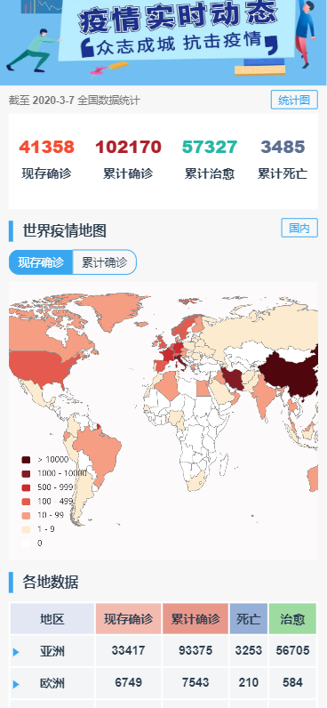

# 2019ncov-about
## Vue-cli3 + echarts仿丁香园疫情地图实现
> 新冠病毒出现以来，很多人都在思考自己的专业能为疫情做些什么，我也总会想我能做些什么，就希望能帮上一点点忙。在疫情发生开始到现在，基本每天都会查看疫情地图关注动态，所以感觉地图对普通人来说挺直观挺有用的。最开始有想法做类似的网站是因为丁香园之前不支持查看省市地区，只能查看全国地图（不过等我磨磨唧唧弄的差不多他们都已经优化了很多版啦~），不过既然开始了所以还是想做完，心理稍安，之后想到了啥再慢慢加吧~

## 数据来源
- [BlankerL](https://github.com/BlankerL/DXY-COVID-19-Crawler)
- [天行数据](https://www.tianapi.com/apiview/169)

感恩数据大大！

## View
样子差不多，支持查看世界，全国，省市地图和地区数据表格：

### 首页

辟谣用到了Swiper插件

### 省份

### 世界

